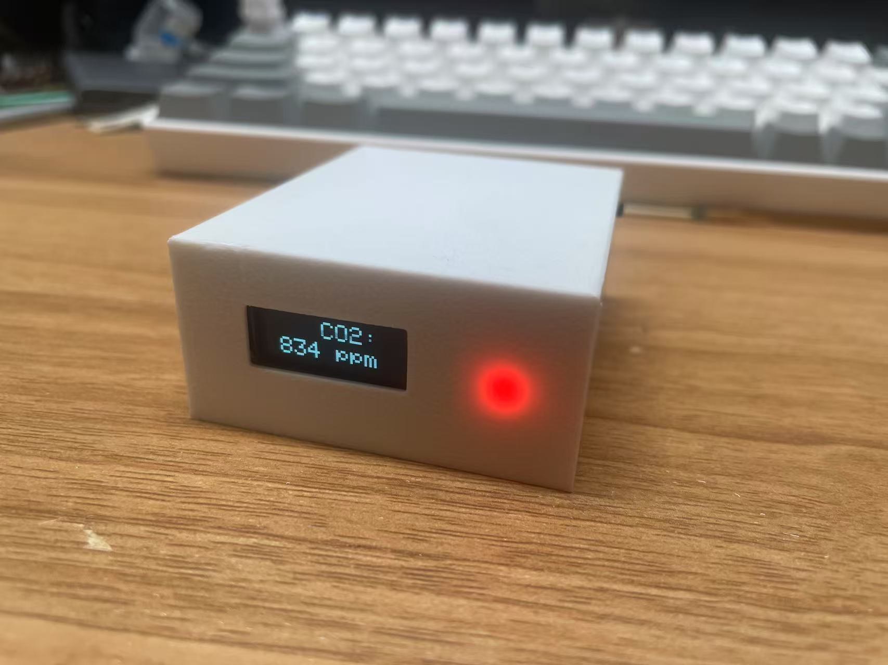

# CO2 Monitor with S8 Sensor and OLED Display

 *(Replace with your actual image)*

## Overview

This project creates a CO2 monitoring system using:
- **Sensirion S8 CO2 sensor** for accurate CO2 measurements
- **OLED display (128x32)** for real-time readings
- **Arduino-compatible boards** (supports multiple architectures)

The device measures CO2 concentration in parts per million (ppm) and displays it on a compact OLED screen, with optional serial output for debugging.

## Features

- Real-time CO2 concentration display
- Sensor health verification on startup
- Support for multiple Arduino platforms:
  - Standard AVR boards
  - RP2040-based boards
  - Software Serial fallback
- Clean OLED interface with large readable numbers

## Hardware Requirements

- **Microcontroller**: Arduino (Uno, Nano, etc.), RP2040, or compatible
- **CO2 Sensor**: Sensirion S8 (UART interface)
- **Display**: SSD1306-based 128x32 OLED (I2C)
- **Connections**:
  - S8 Sensor: RX/TX pins (configurable)
  - OLED: I2C (default address 0x3C)

## Wiring Diagram

```
S8 Sensor       Microcontroller
-----------     ----------------
    TX     →     RX (Pin 10*)
    RX     →     TX (Pin 11*)
    VCC    →     5V
    GND    →     GND

OLED Display
-----------     ----------------
    SDA    →     A4 (or board SDA)
    SCL    →     A5 (or board SCL)
    VCC    →     3.3V-5V
    GND    →     GND

*Pins configurable in code
```

## Installation

1. **Clone this repository**:
   ```bash
   git clone https://github.com/yourusername/co2-monitor-s8.git
   ```

2. **Install required libraries**:
   - [Adafruit SSD1306](https://github.com/adafruit/Adafruit_SSD1306)
   - [Adafruit GFX Library](https://github.com/adafruit/Adafruit-GFX-Library)
   - [S8_UART Library](https://github.com/Sensirion/arduino-uart-s8) *(Include your library or link to it)*

3. **Configure hardware**:
   - Adjust pin definitions in the `Configuration` section of the code if needed
   - Connect hardware as shown in wiring diagram

4. **Upload to your board**

## Usage

1. Power on the device
2. The OLED will show:
   - Startup sequence
   - Sensor verification
   - Then continuous CO2 readings
3. Serial monitor (115200 baud) will show debug information

## Configuration

Modify these in the code as needed:
```cpp
#define DEBUG_BAUDRATE 115200   // Serial monitor speed
#define S8_RX_PIN 10            // S8 RX pin
#define S8_TX_PIN 11            // S8 TX pin
#define OLED_ADDRESS 0x3C        // I2C address
```

## Troubleshooting

**Problem**: OLED not working  
**Solution**: 
- Verify I2C connections
- Check if your display needs different I2C address
- Some boards require pull-up resistors (4.7kΩ) on SDA/SCL

**Problem**: S8 sensor not detected  
**Solution**:
- Check UART connections (TX→RX, RX→TX)
- Verify sensor power (5V)
- Some boards may need SoftwareSerial configuration

## License

[MIT License](LICENSE) *(Choose your preferred license)*

## Contributing

Pull requests are welcome! For major changes, please open an issue first.

